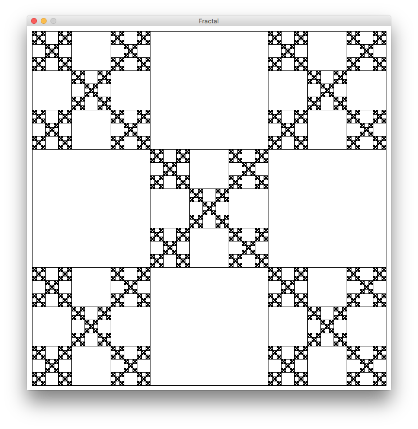
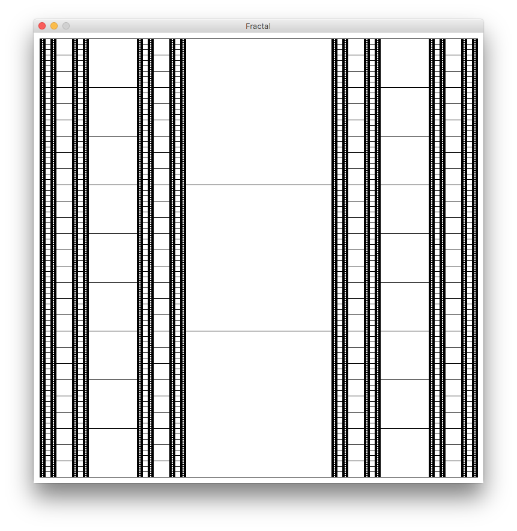
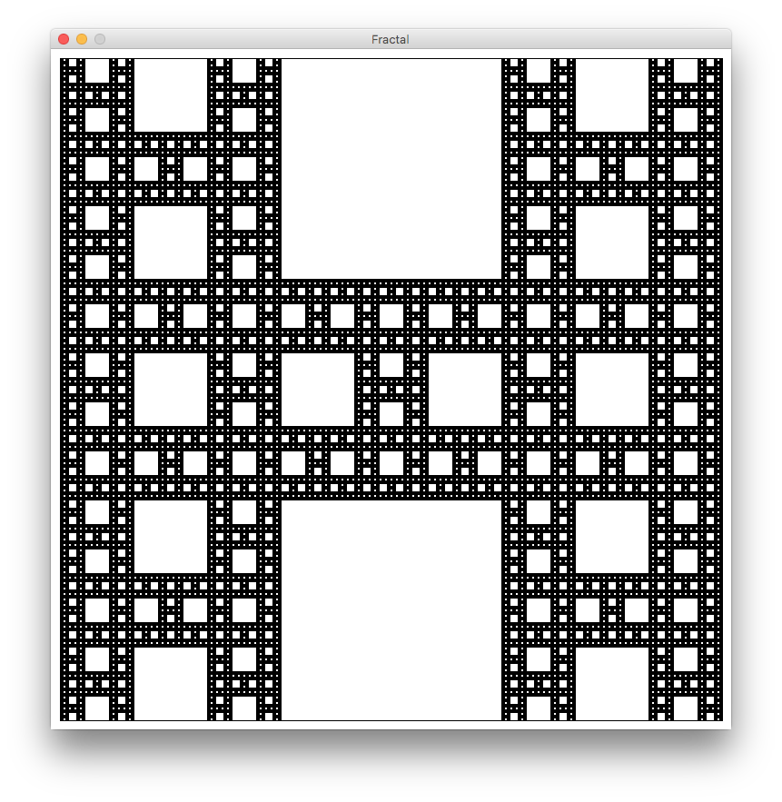

# Fractal

## 環境
Proseccing 3.3.6 を使用。

## 使いかた
- 画面上の何処でもよいのでクリックすると、1段階くり抜かれます。白いところがくり抜かれたところ。
- くりぬける最大数があります。(それ以上くり抜くと模様が見えないため)

## 模様の変えかた
35行めの

```java
if((i%2 == 1 && j%2 == 0) || (i%2 == 0 && j%2 == 1))
```

の部分を変化させる事によって様々な模様を作ることが可能。
因みに枠線が気になる場合は17行目の

```java
  // stroke(255);
```

を復活させれば良い。


### 使用例

- 以下の条件の場合(デフォルト)

```java
if((i%2 == 1 && j%2 == 0) || (i%2 == 0 && j%2 == 1))
```



- 以下の条件の場合
```java
if((i%2 == 1 && j%2 == 0) || (i%2 == 1 && j%2 == 1))
```


- 以下の条件の場合
```java
(i%2 == 1 && j%2 == 0) || (i%2 == 1 && j%2 == 0)
```



などなど。
